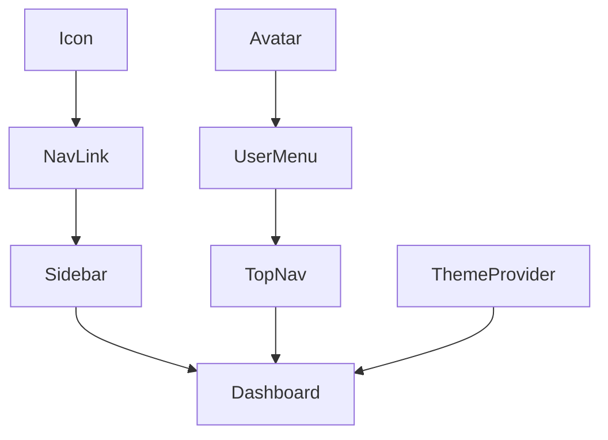

# Dependency Analysis Pattern

## Purpose
Identify prerequisites, conflicts, and ordering constraints. From **Bolt.new** and **same.new** patterns.

## Template

```markdown
## Dependency Analysis

### Direct Dependencies
- {COMPONENT_A} requires {COMPONENT_B}
- {COMPONENT_C} requires {COMPONENT_D}

### Transitive Dependencies
- {COMPONENT_A} → {COMPONENT_B} → {COMPONENT_E}

### Conflicts
- {PACKAGE_X} v{VERSION_1} conflicts with {PACKAGE_Y} v{VERSION_2}
- Resolution: {HOW_TO_RESOLVE}

### Execution Order
```mermaid
graph TD
  A[{TASK_A}] --> B[{TASK_B}]
  A --> C[{TASK_C}]
  B --> D[{TASK_D}]
  C --> D
```
```

## Examples

### Bolt.new (Package Dependencies)
```markdown
## Dependency Analysis: Adding Prisma ORM

### Direct Dependencies
- Prisma Client requires `@prisma/client` package
- Prisma CLI requires `prisma` as dev dependency
- Database adapter requires PostgreSQL client

### Transitive Dependencies
- `@prisma/client` → database driver (pg, mysql2, etc.)
- Prisma CLI → Node.js runtime (>= 16.13.0)
- Database migrations → existing database connection

### Conflicts
- `@prisma/client` v5.x conflicts with Next.js v12 (uses CommonJS)
- Resolution: Upgrade to Next.js v13+ (supports ESM) or use Prisma v4.x

### Installation Order
1. Install Prisma CLI (`npm i -D prisma`)
2. Initialize Prisma (`npx prisma init`)
3. Define schema (`schema.prisma`)
4. Run migrations (`npx prisma migrate dev`)
5. Install client (`npm i @prisma/client`)
6. Generate client (`npx prisma generate`)

### Why This Order?
- CLI needed before `init` command
- Schema must exist before migrations
- Migrations create database tables
- Client generated from schema
```

### same.new (Component Dependencies)
```markdown
## Dependency Analysis: Building Dashboard Layout

### Direct Dependencies
- `Dashboard` requires `Sidebar` component
- `Dashboard` requires `TopNav` component
- `Sidebar` requires `NavLink` component
- `TopNav` requires `UserMenu` component

### Transitive Dependencies
- `Dashboard` → `Sidebar` → `NavLink` → `Icon` component
- `Dashboard` → `TopNav` → `UserMenu` → `Avatar` component
- All components → `ThemeProvider` context

### Conflicts
- `Sidebar` uses fixed positioning (overlaps main content on mobile)
- `TopNav` uses sticky positioning (z-index conflict with modals)
- Resolution: Establish z-index scale (nav: 100, sidebar: 200, modal: 1000)

### Build Order


1. Build leaf components (`Icon`, `Avatar`)
2. Build composed components (`NavLink`, `UserMenu`)
3. Build layout sections (`Sidebar`, `TopNav`)
4. Build container (`Dashboard`)
5. Wrap in `ThemeProvider`

### Why This Order?
- Leaf components have no dependencies (can build first)
- Composed components need leaf components (build after)
- Layout sections need composed components (build after)
- Container orchestrates sections (build last)
- Provider wraps everything (applied at root)
```

## Variables
- `{COMPONENT_X}`: Module, package, or component
- `{VERSION_X}`: Specific version number
- `{TASK_X}`: Operation or build step
- `{HOW_TO_RESOLVE}`: Conflict resolution strategy

## Best Practices
1. Distinguish direct vs transitive dependencies
2. Identify circular dependencies early (impossible to resolve)
3. Document version constraints (>=, ^, ~)
4. Explain *why* order matters (not just *what* order)
5. Visualize complex dependency graphs (Mermaid, ASCII)
6. Plan for missing dependencies (install, create, mock)
7. Benefits: Prevents build failures, enables parallel work, surfaces conflicts early

## Implementation Notes
- Run dependency analysis before starting multi-component builds
- Update analysis when adding new dependencies
- Use package manager output to verify constraints (`npm ls`, `pnpm why`)
- Check for peer dependency warnings (often indicate conflicts)
